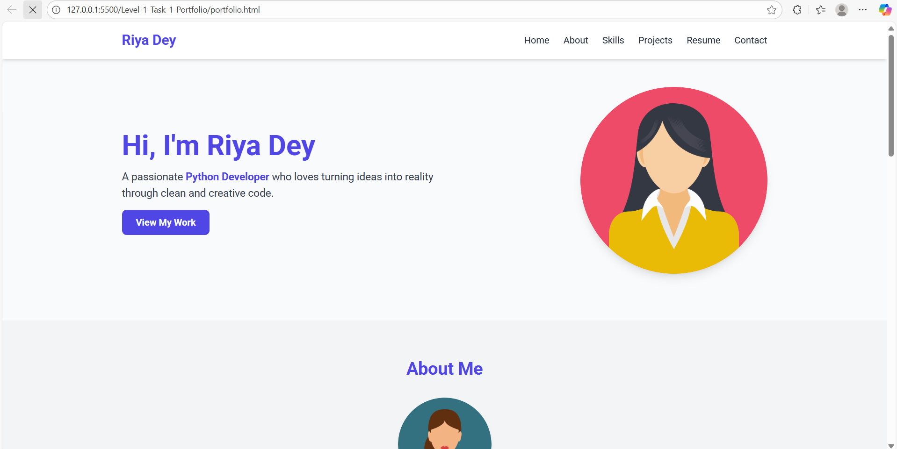

# 🌟 Riya Dey - Personal Portfolio Website

Welcome to my *Personal Portfolio Website, built using **HTML* and *Tailwind CSS*.  
This project showcases my skills, projects, and achievements with a modern, responsive design.

---

## 🎨 Features

- Responsive layout for all devices  
- Built with HTML and Tailwind CSS  
- Smooth, minimal, and professional UI  
- Sections for About, Skills, Projects, Resume, and Contact  
- Easy to update and customize  

---

## 🧱 Sections Included

- *Header:* My name and navigation links  
- *About:* A short bio and profile image  
- *Skills:* List of technologies and tools I use  
- *Projects:* Highlights of my work with descriptions and links  
- *Resume:* Download button for my resume (PDF)  
- *Contact:* My email, links, and other contact info  
- *Footer:* Copyright notice  

---

## 🖼 Preview
      

---

## 🛠 Technologies Used

- *HTML5*
- *Tailwind CSS*
- *Flaticon* (for icons and images)

---
## Clone the repository
To get a local copy of this project on your system, follow this:

```bash
git clone https://github.com/Riya6567/CodSoft.git
