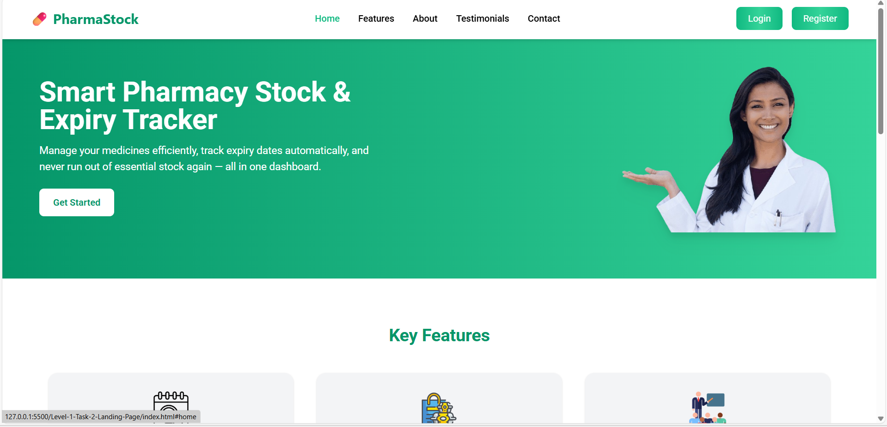

# 💊 PharmaStock - Pharmacy Stock & Expiry Tracker Landing Page

This is a responsive *landing page* built using *HTML and Tailwind CSS* for a web application called *PharmaStock* — a smart solution to manage pharmacy inventory and track medicine expiry dates efficiently.

---

## 🚀 Features

- Modern, responsive design (works on all devices)
- Built entirely with HTML and Tailwind CSS
- Clean layout with hero, features, testimonials, and contact sections
- Easy to customize and extend
- Professionally designed color theme (green + white)

---

## 🧠 Sections Included

- *Header:* Navigation bar with logo and links  
- *Hero Section:* Introduction to the app with a call-to-action button  
- *Features:* Highlights key features like expiry alerts, stock tracking, and analytics  
- *About:* Brief about the app and its purpose  
- *Testimonials:* User reviews and feedback  
- *Contact Section:* Contact info and call-to-action button  
- *Footer:* Copyright and basic info

 ---

## 🛠 Technologies Used

- *HTML5*
- *Tailwind CSS*
- *Flaticon* (for free icons)

---

## 🖼 Preview

Here’s how the landing page looks 👇  

---
